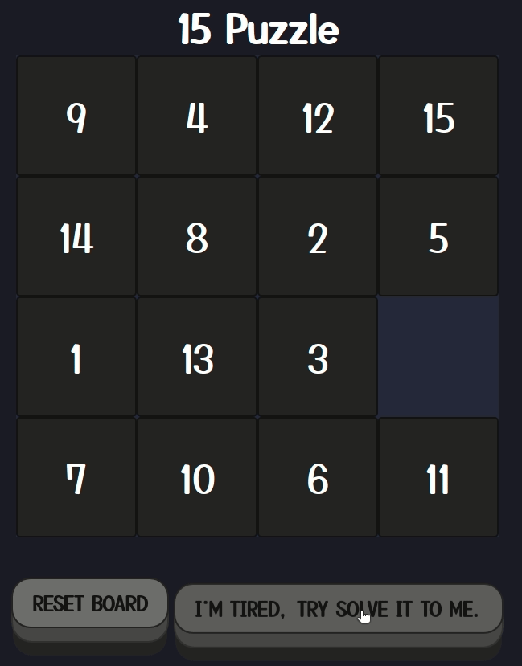

# 15 Puzzle Solver (A* Search)
Available at: [https://sirvaizard.github.io/15puzzle/](https://sirvaizard.github.io/15puzzle/)

## Heuristic
- g(s) = pieces in the wrong place
- h(s) = Manhattan distance
- f(s) = g(s) + h(s)